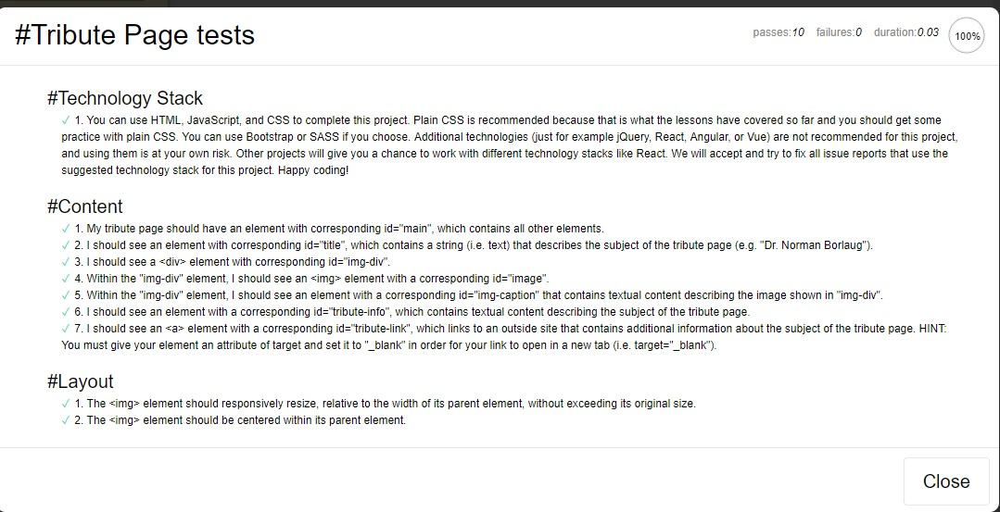
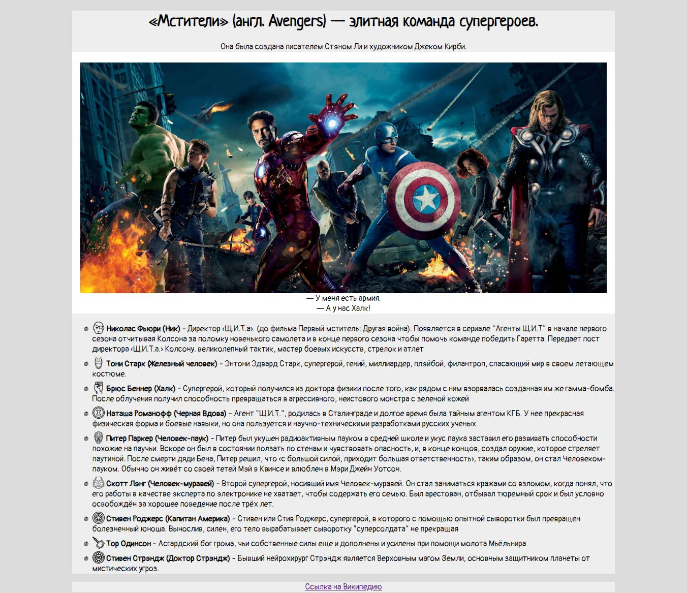

##Проект: Tribute Page 
**Ссылка:** [https://learn.freecodecamp.org](https://learn.freecodecamp.org/responsive-web-design/responsive-web-design-projects/build-a-tribute-page/)
**No. 1**
**Описание:** Нужно сделать разметку страницы имеющую следующие id по примеру существующей:
- `id="main"` 		- основной блок;
- `id="title"` 		- название содержимого страницы;
- `id="img-div" `		- обертка для логотипа страницы и его описания;
- `id="image"`		- логотип страницы;
- `id="img-caption"`	- описание логотипа;
- `id="tribute-info"`- обертка для списка
- `<a id="tribute-link" target="_blank">` - внешняя ссылка

**Пройдено тестов на 100%:**

**Скриншот проекта:**

