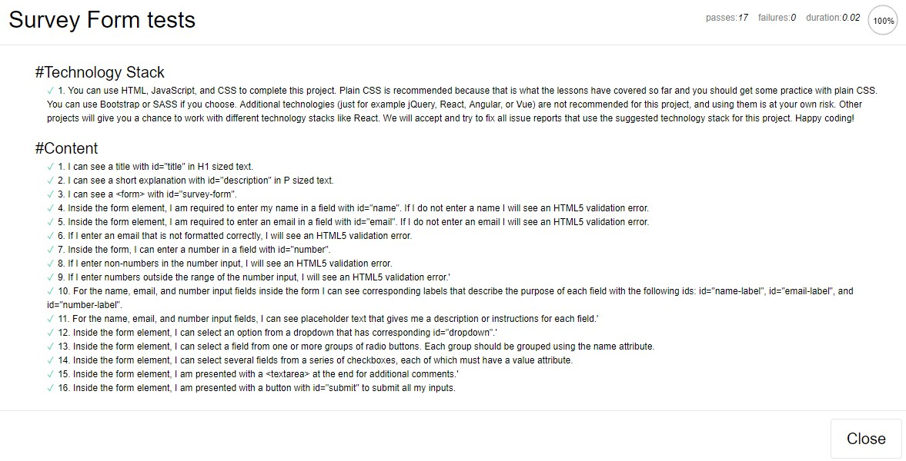
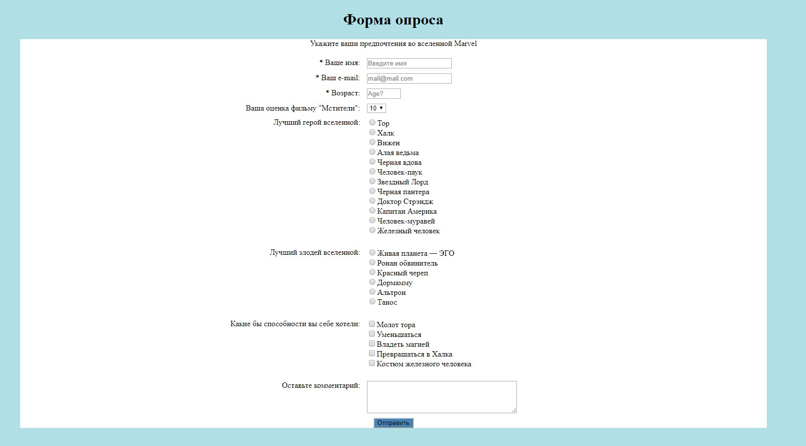

##Проект: Tribute Page  
**Ссылка:** [https://learn.freecodecamp.org](https://learn.freecodecamp.org/responsive-web-design/responsive-web-design-projects/build-a-survey-form/)  
**Просмотр:** [Tribute Page](https://raw.githack.com/tanderbull/frontend.lesson/master/work/day25/index.html)  
**No. 2**  
**Описание:** Нужно сделать форму на странице имеющую следующие id:
- `h1 id="title"` 			- Заголовок;
- `p id="description"` 		- Описание;
- `form id="survey-form" `	- Форма;
- `input name id="name"`	- поле ввода имени;
- `label  id="name-label"`	- описание поля ввода имени;
- `input id="email"`		- поле ввода e-mail с проверкой;
- `label  id="email-label"` - описание поля ввода email;
- `input id="number"`		- поле ввода возраста с минимальным и максимальным значением;
- `id="number-label"`		- описание поля ввода возраста;
- `id="dropdown"`			- выпадающий список;
- `id="submit"`				- кнопка отправки формы;
- Две группы с переключателями, каждая группа сгруппированна по `name`
- Группа чекбоксов, в каждом значении свой `value` атрибут
- Поле комментария `textarea`

**Пройдено тестов на 100%:**


**Скриншот проекта:**

