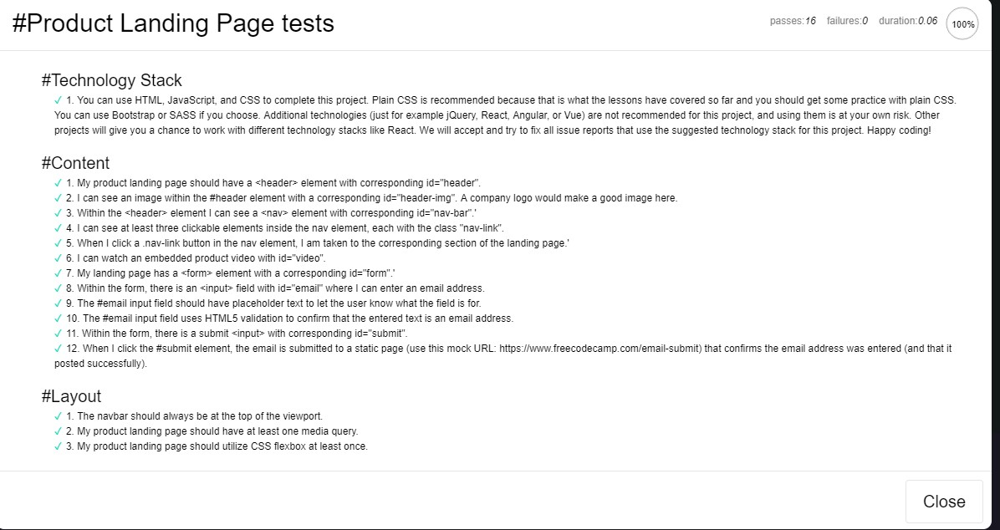
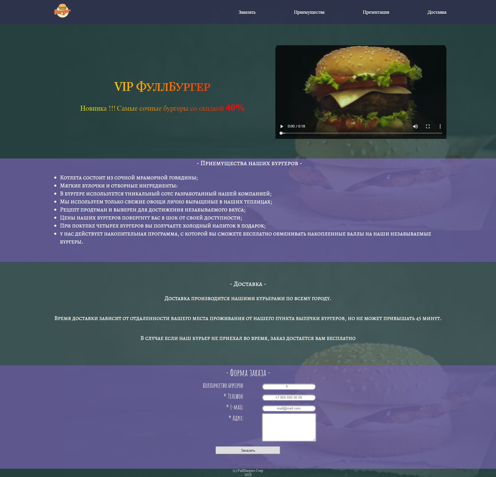

##Проект: Product Landing Page    

**Ссылка:** [https://learn.freecodecamp.org](https://learn.freecodecamp.org/responsive-web-design/responsive-web-design-projects/build-a-product-landing-page/)  

**Просмотр:** [Product Landing Page](https://raw.githack.com/tanderbull/frontend.lesson/master/work/day27/index.html)  

**No. 3**  

**Описание:** Необходимо создать лендинг продукта включающий следующие условия:

- `id="header"` 			- Header;

- `id="header-img"` 		- Логотип;

- `nav id="nav-bar" `		- Навигация;

- `nav-link`				- li блоки навигации (не менее 3-х элементов);

- `id="video"`				- Видео ;

- `form id="form"` 			- Форма ;

- `input id="email"`		- Поле E-mail ;

- `input id="submit"`		- Кнопка отправки ;

- Форма настроена на отправку на адрес https://www.freecodecamp.com/email-submit  ;

- `.nav-link`	должен переносить к якорю на странице  ;

- Использовать хотя-бы 1 медиазапрос  ;

- Использовать `flexbox` хотябы 1 раз;

- Панель навигации зафиксированна в верхней области просмотра;

**Пройдено тестов на 100%:**

**Скриншот проекта:**

