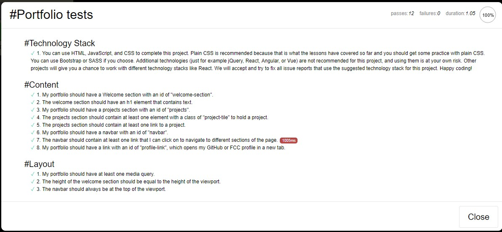
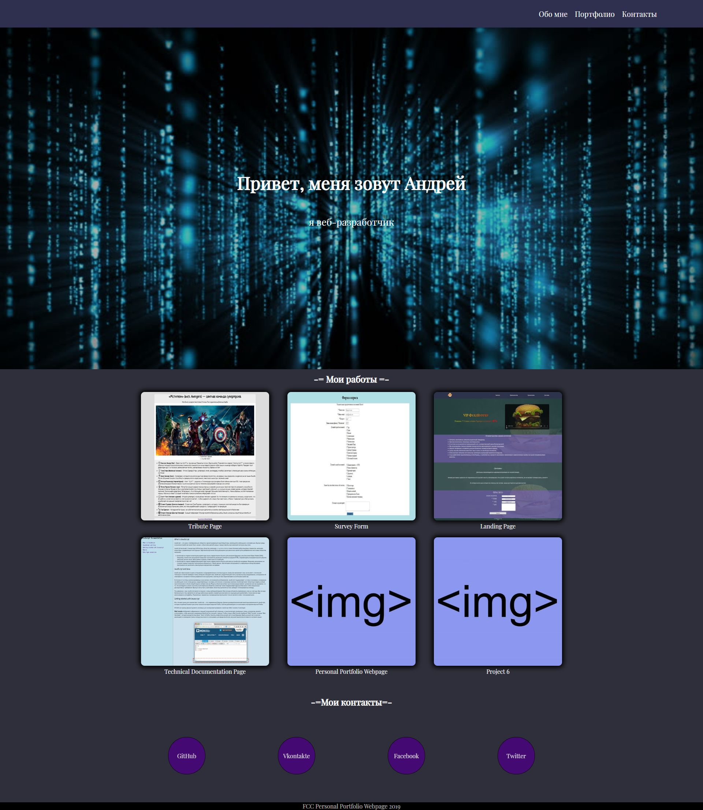

##Проект: Technical Documentation Page   

**Ссылка:** [https://learn.freecodecamp.org](https://learn.freecodecamp.org/responsive-web-design/responsive-web-design-projects/build-a-personal-portfolio-webpage)  

**Просмотр:** [Technical Documentation Page](https://raw.githack.com/tanderbull/frontend.lesson/master/work/day31/index.html)  

**No. 5**  

**Описание:** Необходимо создать страницу-портфолио, которая будет соответствовать условиям задания.  

**Пройдено тестов на 100%:**  

**Скриншот проекта:**  

